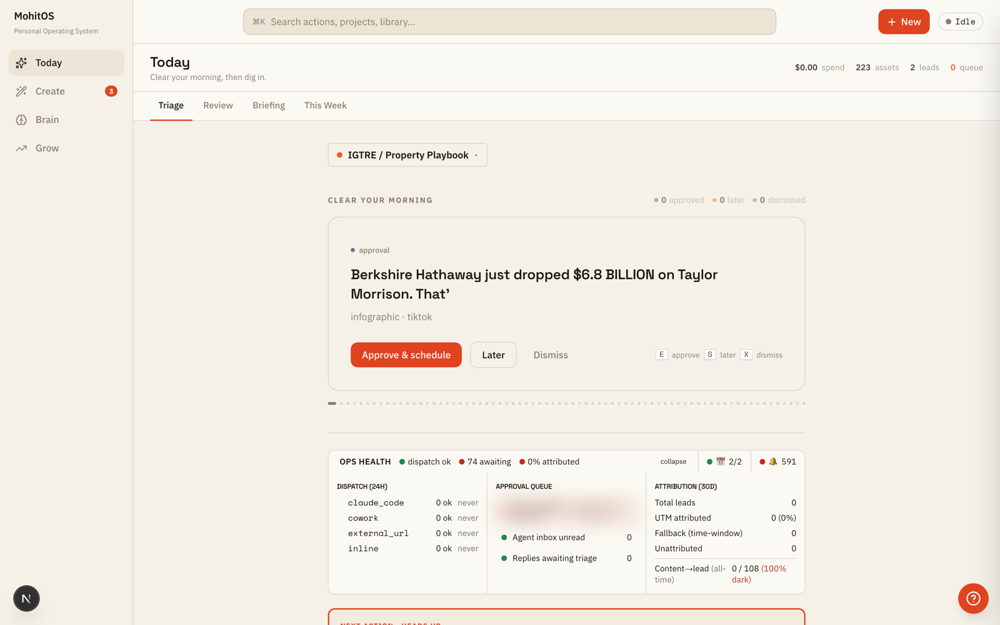
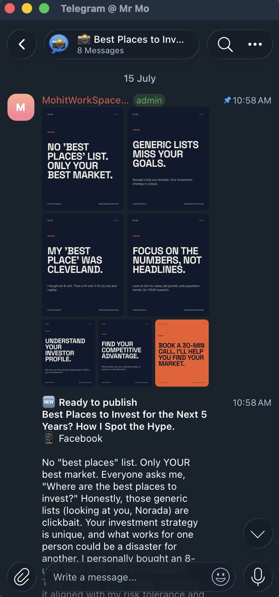
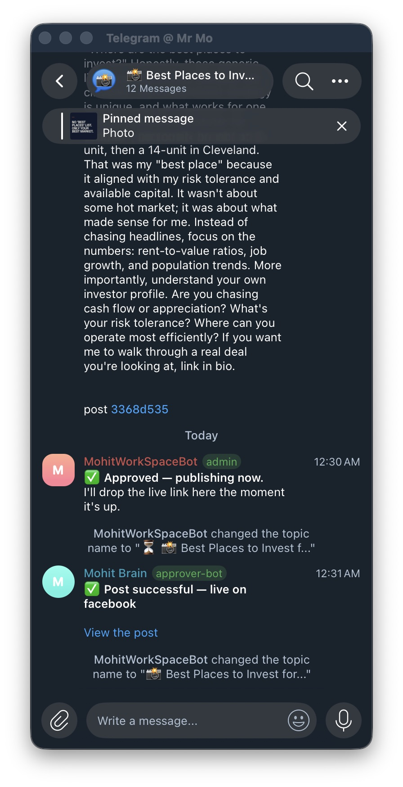
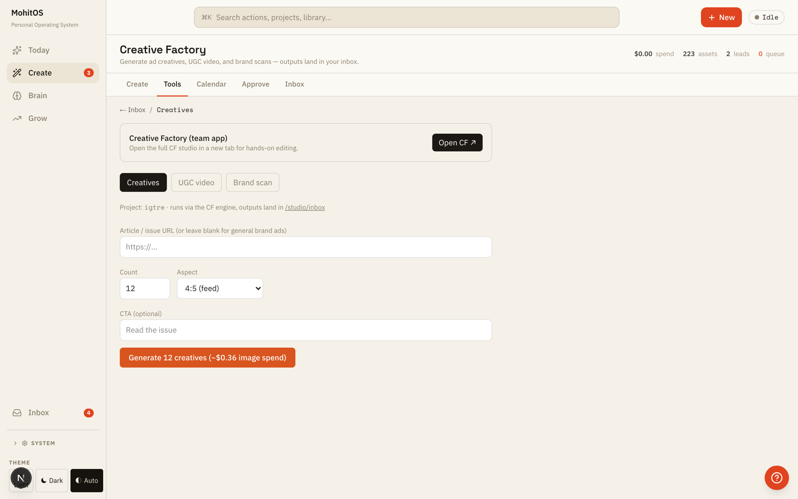
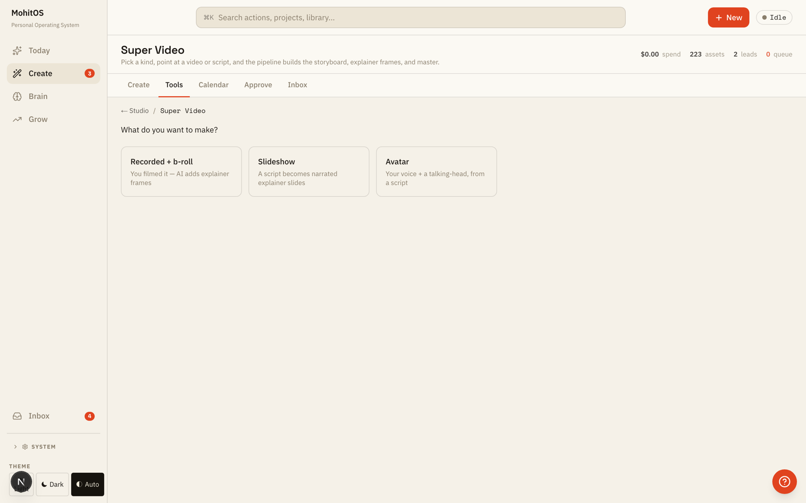
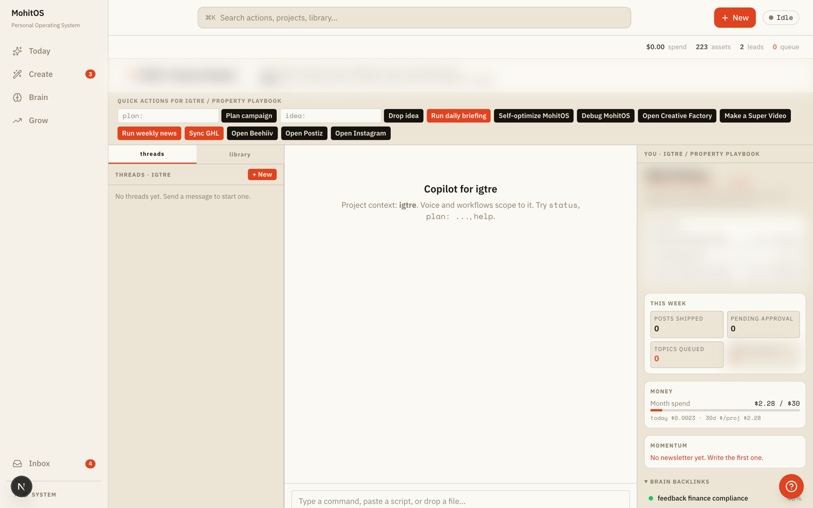
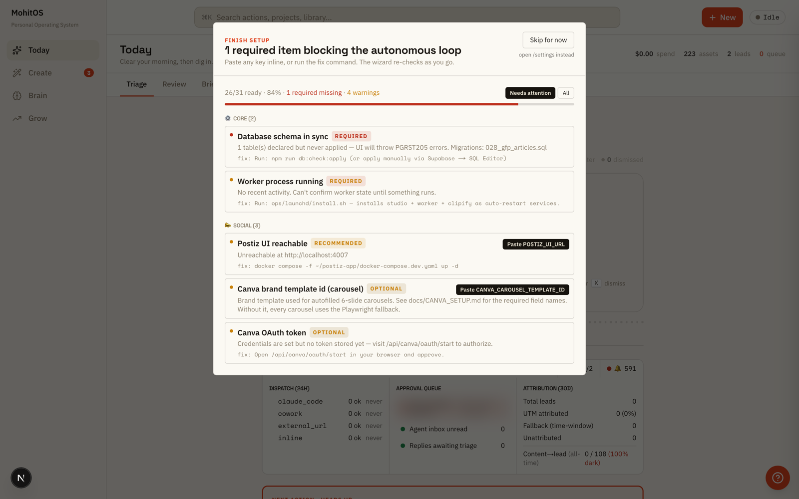

# ai-marketing-os

**An engineering case study of MohitOS: the "AI VP of Marketing" I built instead of hiring one.**

The production codebase is private (it holds brand strategy, credentials, and business data). This repo documents the architecture, the design decisions, and the honest operational numbers. Every claim here is grounded in the real system.

## What it is

MohitOS is a marketing operations console that runs my real-estate content brand (Idiot's Guide To Real Estate) and its newsletter (Property Playbook) end to end. It replaces the marketing hire and the agency a solo operator would normally need.

The stack:

- **Next.js 16 studio UI** for the daily console: idea cards, approval queue, calendar, observability.
- **Supabase Postgres** as the single database: content, jobs, brands, audit trail.
- **pg-boss job queue + a worker process** running 50+ handlers: idea generation, captioning, carousel rendering, short-form video (voiceover, b-roll, burned captions), newsletter drafting, publishing, and metrics polling.
- **Telegram as the control plane.** Two bots on a $6/month DigitalOcean droplet under systemd carry approval cards, feedback, and escalations to my phone. The publish loop is fully cloud-side, so the laptop can be off.
- **Self-hosted Postiz** (open-source social scheduler) on its own droplet, publishing to Instagram and Facebook. TikTok is connected but sandboxed pending platform app approval.
- **Claude Code as the daily driver.** I operate and extend the system through it; agent skills encode how each content format gets made.
- **External AI via OpenRouter and fal.ai**: text models routed by cost, image and video generation, plus ElevenLabs or local Kokoro for voiceover.

## Why it exists

I run the company alone. Content businesses die on throughput: ideation, production, approvals, publishing, and measurement every single day. Hiring was the default answer; I wanted to know how far one operator could get with agents, a queue, and hard guardrails instead.

Two design convictions came out of that:

1. **The human holds the publish gate.** Agents generate everything. Nothing reaches an audience without my tap on a Telegram card. This is not a demo constraint; it is the product.
2. **Guardrails are the interesting engineering.** Spend caps, notification budgets, quiet hours, compliance linting, and fabrication tripwires took more care than the generation itself.

## High-level results

Honest numbers, including the unflattering ones:

- The full loop is live: morning idea cards, one-tap approval, generation jobs, a Telegram approval card, cloud publish to Instagram and Facebook, and status reconciliation back from the publisher.
- At one point the machine had produced 94 pieces of content and shipped 11. Generation was never the constraint; approvals and shipping were. That reshaped the whole system toward the approval loop.
- The pipeline silently stalled for about 12 days (June 15 to 27) on an unapplied database migration plus one unset environment variable on the droplet. The postmortem drove the observability work (status pill, ops health strip) documented here.
- Notification load was cut from roughly 60 pings a morning to 3 to 5 meaningful pushes a day through batching, silent tiers, and quiet hours.
- Infrastructure cost: a couple of small droplets at $6 to $12 a month each, plus pay-per-use AI APIs. OSS and free tiers first, by policy.

## The system, in screenshots

Anything private (revenue goals, one stale-queue line) is blurred on purpose; everything else is the real console.

### The daily loop

Every morning the system proposes idea cards and stops there: Approve & schedule, Later, or Dismiss. The ops health strip below shows dispatch status per channel, approval queue depth, and 30-day attribution in one glance.

Approved content arrives on my phone as a Telegram card before it can publish. Nothing goes out without a tap. After approval, the loop runs cloud-side and reports back with the live link.

| Approval card | After the tap |
|---|---|
|  |  |

### Generation, with the cost shown first

Creative Factory queues a batch of 12 ad creatives and shows the estimated image spend (about $0.36) before I commit to the run. Super Video picks between three pipelines: recorded footage plus AI b-roll, a narrated slideshow, or an avatar reading the script.

### Operating it

The project copilot is scoped to one brand: quick actions, a chat that only knows this project's voice and workflows, and a live spend meter ($2.28 of a $30 monthly budget in this shot).

On load, a setup doctor checks its own 31-item configuration and prints the exact fix command for anything missing, here an unapplied database migration.

## Docs

| Doc | Covers |
|---|---|
| [docs/architecture.md](docs/architecture.md) | System diagram, the content pipeline flow, and the parent/child Telegram bot topology (Mermaid). |
| [docs/human-in-the-loop.md](docs/human-in-the-loop.md) | The approval architecture: forum-topic channels, approve/reject/change callbacks, the feedback-to-directive self-training loop, and notification fatigue design. |
| [docs/cost-controls.md](docs/cost-controls.md) | Model routing by cost, paid renders behind a human tap, daily caps, and free-tier math. |
| [docs/reliability.md](docs/reliability.md) | Self-healing bridge watchdogs, moving the loop off the laptop, the trace-threaded audit trail, and status observability. |
