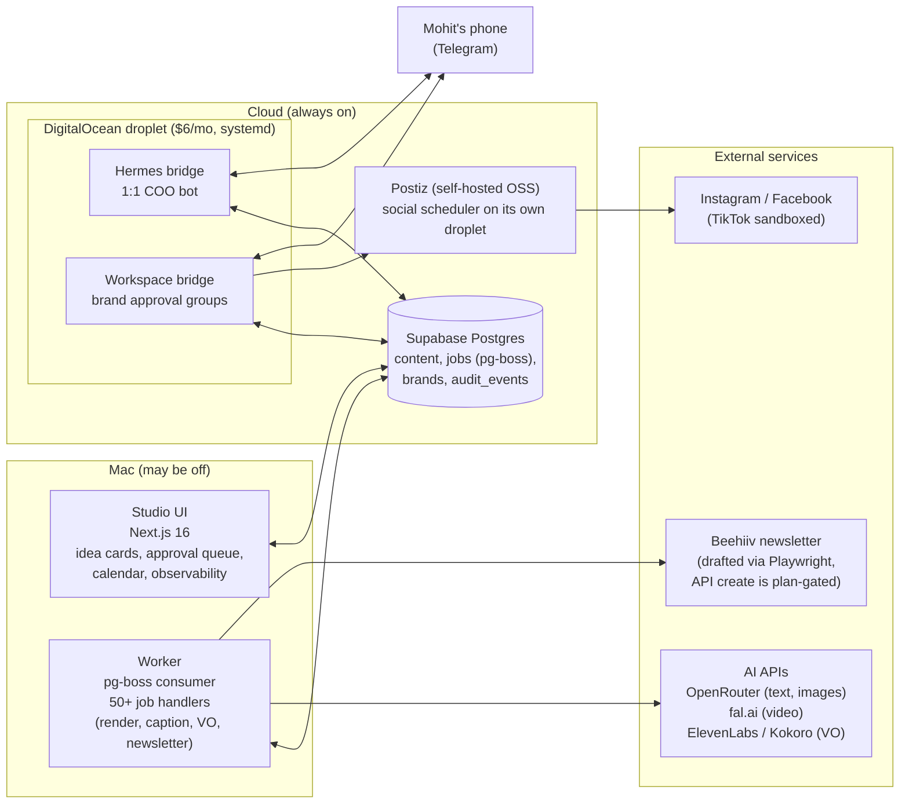
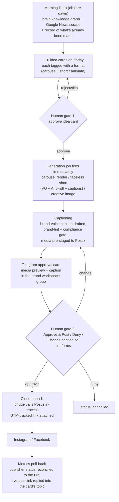
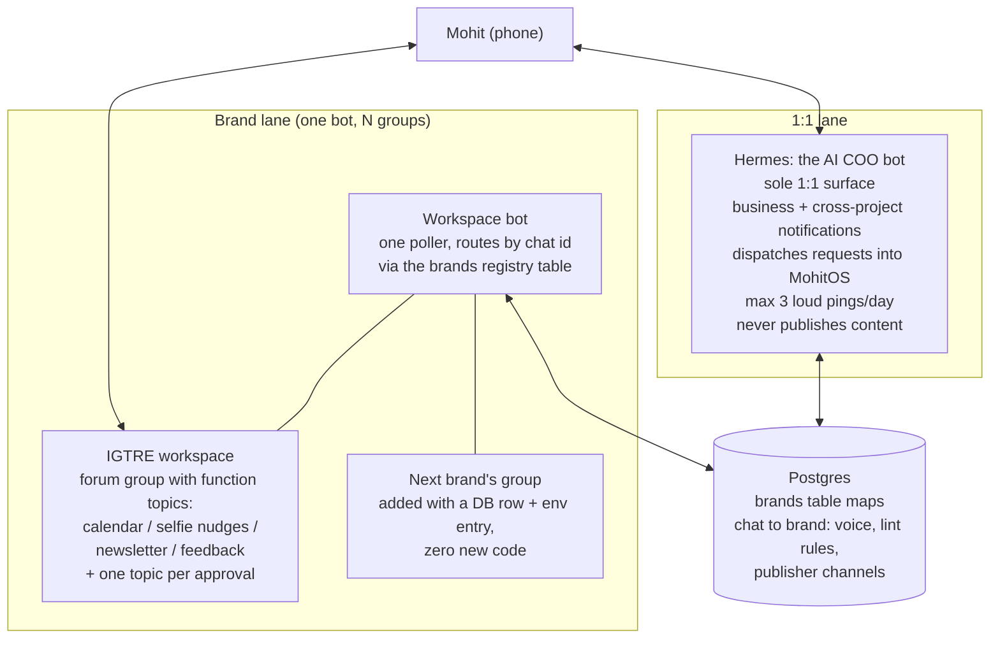

# Architecture

MohitOS is four processes around one Postgres database, with Telegram as the human interface and a self-hosted publisher at the end of the line. The design goal: the approve-to-publish loop must run entirely in the cloud, because my laptop may be asleep or off.

## System diagram

Key properties:

- **One database, no message bus.** pg-boss runs the job queue inside Postgres. Bridges enqueue jobs from the droplet; the Mac worker drains them whenever it is awake. Heavy work (rendering, Playwright) stays on the Mac because a 1 GB droplet cannot afford it.
- **The publish path never touches the Mac.** The workspace bridge reads the captioned queue from Postgres directly, publishes to Postiz in-process on approval, and writes status back. Media is pre-staged to Postiz at caption time (while the Mac is on) so the droplet can publish files it could never read from a laptop disk.
- **Claude Code is the operator console.** I build, debug, and run one-off operations through it; agent skills define house style and per-format recipes. The app itself calls models through OpenRouter with cost-based routing (see [cost-controls.md](cost-controls.md)).

## Content pipeline flow

The daily loop, from idea to published post to measured result:

Notes on the two gates:

- Gate 1 (idea) exists so money and quota are only spent on content I actually want. A "green tier" of formats can skip this gate for auto-generation, but with hard daily caps (see cost controls). Publishing is never auto-approved regardless of tier.
- Gate 2 (publish) is enforced server-side: the approve endpoint re-runs caption lint and brand-claim lint and rejects violations with a 422 even if a bad caption somehow reached a card.
- Newsletters take a parallel lane: drafted into Beehiiv as drafts via Playwright browser automation (the create API is plan-gated), with a Telegram card linking to the draft for review. Automation never clicks Send.

## Telegram bot topology

Telegram is split into a parent and N brand children, on separate bot tokens (Telegram allows one long-poller per token, so separate bots avoid contention).

Why it is shaped this way:

- **One file, two modes.** Both bridges run the same script with a mode flag and their own token and update-cursor file. Not a fork; a deployment concern.
- **Brand isolation is data, not code.** Each brand row carries its approval chat, its publisher channel ids, its voice rules, and its banned-claims list. Feedback sent in a brand's group can only train that brand's skills (the classifier is constrained to a per-brand allowlist). Adding a brand is a row, a Telegram group, and env entries.
- **Hermes is deliberately weak.** It can look things up, dispatch jobs, and nudge me. It cannot publish. Two earlier 1:1 bots were consolidated into it after agent sprawl proved worse than one good agent.
